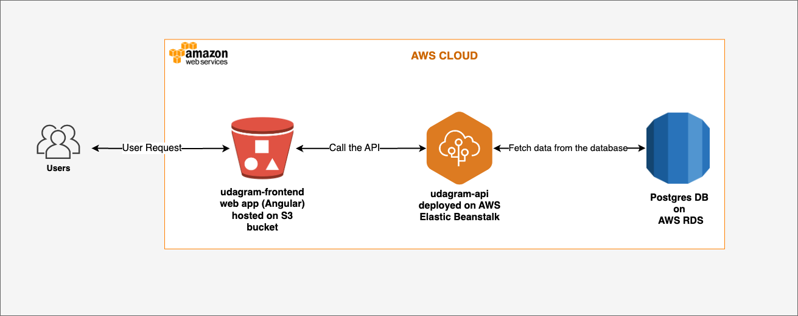

## Overview infratructure for Cloud

## AWS
### RDS Postgres
The application server uses AWS RDS Postgres with host: `database-1.c22azbiywbnb.us-west-2.rds.amazonaws.com`

### Elastic Beanstalk
Server is deployed on AWS Elastic Beanstalk (build file, file upload, ... is stored at S3 bucket)

EB URL: http://udagram-api-dev.us-west-2.elasticbeanstalk.com

### S3 Bucket
Frontend is deployed using AWS S3 Bucket.
Access URL: http://hosting-bucket-839635154001.s3-website-us-west-2.amazonaws.com