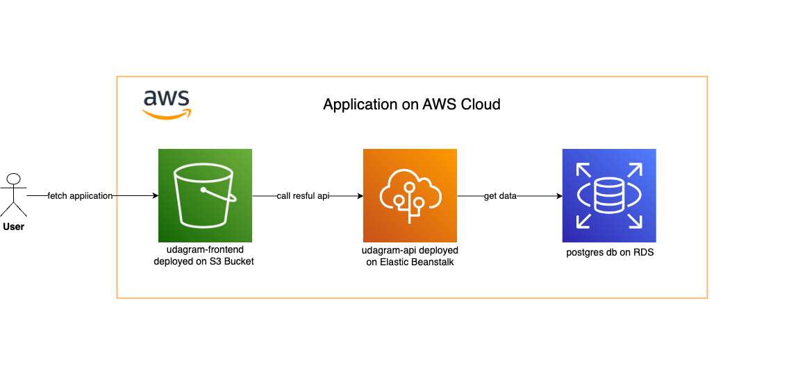
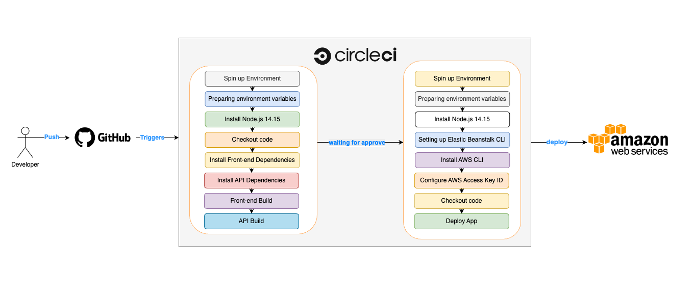

# Hosting a Full Stack Application

## Overview infratructure for Cloud


## Overview pineline on CircleCI



## Environment 
set .env variable

```
- PORT                = 8080
- POSTGRES_HOST       = <DB_IP_Address>
- POSTGRES_PORT       = <DB_Port>
- POSTGRES_DB         = <DB_Name>
- POSTGRES_USERNAME   = <DB_Username>
- POSTGRES_PASSWORD   = <DB_Password>
- URL                 = <Url>
- JWT_SECRET          = <Any_PassPhrase>
- AWS_REGION          = <us-east-1>
- AWS_PROFILE         = <Profile>
- AWS_BUCKET          = <Bucket_Name>

```

## Local Installation
  #### udagram-api
  - install dependencies
    ```
    npm install
    ```
  - run application
    ```
    npm run dev
    ```
#### udagram-frontend
  - install dependencies
    ```
    npm install
    ```
  - run application
    ```
    ng serve
    ```
  - run test
    ```
    ng test
    ```
  - run e2e
    ```
    ng e2e
    ```
        
